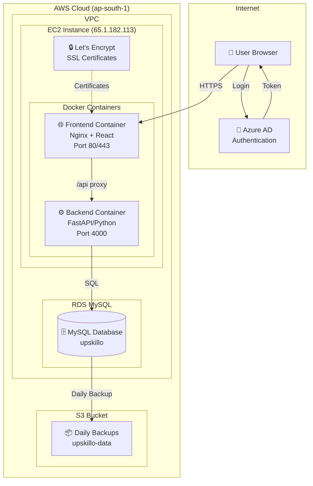
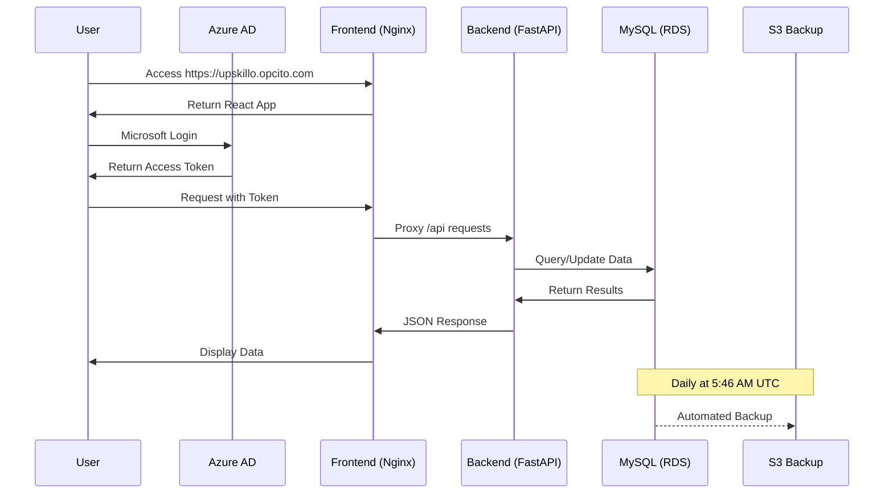
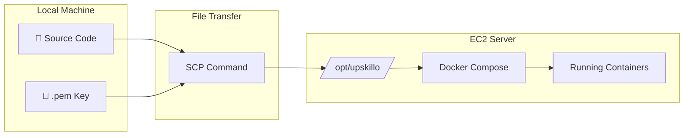

# Upskillo-2026 Deployment Guide

## Overview
This guide covers the complete deployment of the Upskillo application on AWS EC2 with Docker Compose.

---

## Architecture Diagram



---

## Data Flow Diagram



---

## Deployment Flow



---

## S3 Backup Configuration

### Backup Details
| Setting | Value |
|---------|-------|
| **S3 Bucket** | `upskillo-data` |
| **Backup Path** | `s3://upskillo-data/upskillo-backup/` |
| **Backup Schedule** | Daily at 5:46 AM UTC |
| **Backup Format** | `mysql_backup_YYYY-MM-DD_HH-MM.sql.gz` |
| **Retention** | Stored in S3 (manage lifecycle as needed) |

### Backup Script (Cron Job on EC2)
Create `/opt/upskillo/backup.sh`:
```bash
#!/bin/bash
# Database backup script for Upskillo

# Configuration
DB_HOST="upskillo-mysql.cukwnuzu8fg8.ap-south-1.rds.amazonaws.com"
DB_USER="upskilloadmin"
DB_PASS="Upskillo123"
DB_NAME="upskillo"
S3_BUCKET="s3://upskillo-data/upskillo-backup"
BACKUP_FILE="mysql_backup_$(date +%Y-%m-%d_%H-%M).sql.gz"

# Create backup
mysqldump -h $DB_HOST -u $DB_USER -p$DB_PASS $DB_NAME | gzip > /tmp/$BACKUP_FILE

# Upload to S3
aws s3 cp /tmp/$BACKUP_FILE $S3_BUCKET/$BACKUP_FILE --region ap-south-1

# Cleanup local file
rm /tmp/$BACKUP_FILE

echo "Backup completed: $BACKUP_FILE"
```

### Setup Daily Backup Cron
```bash
# Make script executable
chmod +x /opt/upskillo/backup.sh

# Edit crontab
crontab -e

# Add this line for daily backup at 5:46 AM UTC
46 5 * * * /opt/upskillo/backup.sh >> /var/log/upskillo-backup.log 2>&1
```

### Manual Backup Command
```bash
# Create and upload backup manually
mysqldump -h upskillo-mysql.cukwnuzu8fg8.ap-south-1.rds.amazonaws.com -u upskilloadmin -pUpskillo123 upskillo | gzip > /tmp/manual_backup.sql.gz
aws s3 cp /tmp/manual_backup.sql.gz s3://upskillo-data/upskillo-backup/manual_backup_$(date +%Y-%m-%d).sql.gz --region ap-south-1
```

### List Available Backups
```bash
aws s3 ls s3://upskillo-data/upskillo-backup/ --region ap-south-1
```

### Download Specific Backup
```bash
aws s3 cp s3://upskillo-data/upskillo-backup/mysql_backup_2026-02-06_05-46.sql.gz /tmp/ --region ap-south-1
```

---

## Infrastructure Details

| Component | Value |
|-----------|-------|
| **EC2 Public IP** | `65.1.182.113` |
| **Domain** | `upskillo.opcito.com` |
| **AWS Region** | `ap-south-1` (Mumbai) |
| **RDS Endpoint** | `upskillo-mysql.cukwnuzu8fg8.ap-south-1.rds.amazonaws.com:3306` |
| **Key Pair** | `Upskillo-2026.pem` |

---

## Folder Structure

```
Upskillo-2026/
├── BE/                          # Backend (Python/FastAPI)
│   ├── app/
│   │   ├── main.py              # FastAPI application entry
│   │   ├── database.py          # Database connection
│   │   ├── models.py            # SQLAlchemy models
│   │   ├── routers/             # API routes
│   │   ├── schemas/             # Pydantic schemas
│   │   ├── services/            # Business logic
│   │   └── utils/               # Utility functions
│   ├── Dockerfile               # Backend Docker image
│   ├── requirements.txt         # Python dependencies
│   ├── .env                     # Environment variables (not in git)
│   └── env.example              # Example env file
│
├── FE/                          # Frontend (React/Vite)
│   ├── src/
│   │   ├── components/          # React components
│   │   ├── pages/               # Page components
│   │   ├── shared/
│   │   │   └── constants.js     # API URLs, Azure AD config
│   │   ├── AuthContext.jsx      # MSAL authentication
│   │   ├── App.jsx              # Main app component
│   │   └── main.jsx             # Entry point
│   ├── public/                  # Static assets
│   │   ├── banner.jpg           # Main banner image
│   │   ├── logo.png             # App logo
│   │   └── microsoft-icon.png   # Microsoft login icon
│   ├── Dockerfile               # Frontend Docker image
│   ├── nginx.conf               # Nginx configuration (SSL)
│   └── package.json             # Node dependencies
│
├── infra/                       # Terraform infrastructure
│   ├── main.tf                  # AWS resources
│   ├── variables.tf             # Variable definitions
│   ├── terraform.tfvars         # Variable values
│   ├── outputs.tf               # Output values
│   └── user-data.sh.tmpl        # EC2 initialization script
│
├── docker-compose.prod.yml      # Production Docker Compose
├── Upskillo-2026.pem            # SSH key (keep secure!)
└── DEPLOYMENT_GUIDE.md          # This file
```

---

## EC2 Server Structure

```
/opt/upskillo/                   # Application root on EC2
├── BE/                          # Backend code
│   └── .env                     # Backend environment variables
├── FE/                          # Frontend code
├── docker-compose.prod.yml      # Docker Compose file
└── infra/                       # Infrastructure files

/etc/letsencrypt/                # SSL certificates
└── live/upskillo.opcito.com/
    ├── fullchain.pem            # SSL certificate
    └── privkey.pem              # SSL private key
```

---

## Database Configuration

### Connection Details
```
Host: upskillo-mysql.cukwnuzu8fg8.ap-south-1.rds.amazonaws.com
Port: 3306
Database: upskillo
Username: upskilloadmin
Password: Upskillo123
```

### Database Tables
| Table | Description |
|-------|-------------|
| `users` | User accounts |
| `activities` | Activity definitions |
| `user_activities` | User submitted activities |
| `badges` | Badge definitions |
| `user_badges` | Badges assigned to users |
| `tenants` | Tenant/company information |
| `challenge_accepted` | Challenge opt-in records |

---

## Docker Containers

| Container | Port | Description |
|-----------|------|-------------|
| `upskillo-backend-1` | 4000 | FastAPI backend |
| `upskillo-frontend-1` | 80, 443 | Nginx serving React app |

---

## SSH Commands

### Connect to EC2
```bash
ssh -i Upskillo-2026.pem ubuntu@65.1.182.113
```

### Copy files to EC2
```bash
scp -i Upskillo-2026.pem <local-file> ubuntu@65.1.182.113:/tmp/
```

### Copy directory to EC2
```bash
scp -i Upskillo-2026.pem -r <local-dir> ubuntu@65.1.182.113:/tmp/
```

---

## Docker Commands (Run on EC2)

### View running containers
```bash
sudo docker ps
```

### View container logs
```bash
sudo docker logs upskillo-backend-1 --tail 50
sudo docker logs upskillo-frontend-1 --tail 50
```

### Restart containers
```bash
cd /opt/upskillo
sudo docker-compose -f docker-compose.prod.yml restart
```

### Rebuild and restart frontend
```bash
cd /opt/upskillo
sudo docker-compose -f docker-compose.prod.yml up -d --build frontend
```

### Rebuild and restart backend
```bash
cd /opt/upskillo
sudo docker-compose -f docker-compose.prod.yml up -d --build backend
```

### Stop all containers
```bash
cd /opt/upskillo
sudo docker-compose -f docker-compose.prod.yml down
```

### Start all containers
```bash
cd /opt/upskillo
sudo docker-compose -f docker-compose.prod.yml up -d
```

---

## Database Commands (Run on EC2)

### Connect to MySQL
```bash
mysql -h upskillo-mysql.cukwnuzu8fg8.ap-south-1.rds.amazonaws.com -u upskilloadmin -pUpskillo123 upskillo
```

### Show all tables
```bash
mysql -h upskillo-mysql.cukwnuzu8fg8.ap-south-1.rds.amazonaws.com -u upskilloadmin -pUpskillo123 upskillo -e "SHOW TABLES;"
```

### Count users
```bash
mysql -h upskillo-mysql.cukwnuzu8fg8.ap-south-1.rds.amazonaws.com -u upskilloadmin -pUpskillo123 upskillo -e "SELECT COUNT(*) FROM users;"
```

### Reset all user activities (new year)
```bash
mysql -h upskillo-mysql.cukwnuzu8fg8.ap-south-1.rds.amazonaws.com -u upskilloadmin -pUpskillo123 upskillo -e "DELETE FROM user_activities;"
```

### Delete a user by name
```bash
mysql -h upskillo-mysql.cukwnuzu8fg8.ap-south-1.rds.amazonaws.com -u upskilloadmin -pUpskillo123 upskillo -e "DELETE FROM users WHERE name='User Name';"
```

### Restore database from S3 backup
```bash
# Download backup from S3
aws s3 cp s3://upskillo-data/upskillo-backup/mysql_backup_YYYY-MM-DD.sql.gz /tmp/

# Extract and restore
gunzip -c /tmp/mysql_backup_YYYY-MM-DD.sql.gz > /tmp/backup.sql

# Extract only upskillo data (if backup contains multiple databases)
tail -n +1073 /tmp/backup.sql | sed 's/tracker_db_4/upskillo/g' > /tmp/upskillo_data.sql

# Restore with foreign key checks disabled
echo "SET FOREIGN_KEY_CHECKS=0;" | cat - /tmp/upskillo_data.sql | head -n 257 | mysql -h upskillo-mysql.cukwnuzu8fg8.ap-south-1.rds.amazonaws.com -u upskilloadmin -pUpskillo123 upskillo
```

---

## SSL Certificate Management

### Check certificate expiry
```bash
sudo certbot certificates
```

### Renew certificate manually
```bash
sudo docker stop upskillo-frontend-1
sudo certbot renew
sudo docker start upskillo-frontend-1
```

### Certificate auto-renewal
Certbot automatically sets up a cron job for renewal. Certificate expires on **2026-05-07**.

---

## Configuration Files

### Backend Environment (.env)
Location: `/opt/upskillo/BE/.env`
```env
DB_USER=upskilloadmin
DB_PASSWORD=Upskillo123
DB_HOST=upskillo-mysql.cukwnuzu8fg8.ap-south-1.rds.amazonaws.com
DB_PORT=3306
DB_NAME=upskillo
```

### Frontend Constants
Location: `FE/src/shared/constants.js`
```javascript
export const APP_NAME = "upskillo-2026";
export const BASE_URL = "https://upskillo.opcito.com/api";
export const CLIENT_ID = "012342fd-6f0d-4205-8db5-acf0bb507671";
export const AUTHORITY = "https://login.microsoftonline.com/7cad185a-c463-46e3-ae25-fec131d6f066";
export const REDIRECT_URL = "https://upskillo.opcito.com/";
```

### Nginx Configuration
Location: `FE/nginx.conf`
- HTTP (port 80) redirects to HTTPS
- HTTPS (port 443) serves frontend and proxies `/api` to backend
- SSL certificates from Let's Encrypt

---

## Deployment Steps (Fresh Deploy)

### 1. Update Frontend Configuration
Edit `FE/src/shared/constants.js`:
- Set `BASE_URL` to your domain
- Set `CLIENT_ID` from Azure AD app registration
- Set `REDIRECT_URL` to your domain

### 2. Copy Files to EC2
```bash
scp -i Upskillo-2026.pem -r BE FE docker-compose.prod.yml ubuntu@65.1.182.113:/tmp/
ssh -i Upskillo-2026.pem ubuntu@65.1.182.113 "sudo mkdir -p /opt/upskillo && sudo mv /tmp/BE /tmp/FE /tmp/docker-compose.prod.yml /opt/upskillo/"
```

### 3. Configure Backend Environment
```bash
ssh -i Upskillo-2026.pem ubuntu@65.1.182.113
sudo nano /opt/upskillo/BE/.env
# Add database credentials
```

### 4. Get SSL Certificate
```bash
sudo apt-get install -y certbot
sudo certbot certonly --standalone -d upskillo.opcito.com --non-interactive --agree-tos --email admin@opcito.com
```

### 5. Build and Start Containers
```bash
cd /opt/upskillo
sudo docker-compose -f docker-compose.prod.yml up -d --build
```

### 6. Verify Deployment
```bash
sudo docker ps
sudo docker logs upskillo-backend-1 --tail 20
sudo docker logs upskillo-frontend-1 --tail 20
```

---

## Updating the Application

### Update Frontend Code
```bash
# From local machine
scp -i Upskillo-2026.pem FE/src/shared/constants.js ubuntu@65.1.182.113:/tmp/
ssh -i Upskillo-2026.pem ubuntu@65.1.182.113 "sudo cp /tmp/constants.js /opt/upskillo/FE/src/shared/ && cd /opt/upskillo && sudo docker-compose -f docker-compose.prod.yml up -d --build frontend"
```

### Update Backend Code
```bash
# From local machine
scp -i Upskillo-2026.pem -r BE/app ubuntu@65.1.182.113:/tmp/
ssh -i Upskillo-2026.pem ubuntu@65.1.182.113 "sudo cp -r /tmp/app /opt/upskillo/BE/ && cd /opt/upskillo && sudo docker-compose -f docker-compose.prod.yml up -d --build backend"
```

### Update Images/Assets
```bash
scp -i Upskillo-2026.pem -r FE/public ubuntu@65.1.182.113:/tmp/
ssh -i Upskillo-2026.pem ubuntu@65.1.182.113 "sudo cp -r /tmp/public/* /opt/upskillo/FE/public/ && cd /opt/upskillo && sudo docker-compose -f docker-compose.prod.yml up -d --build frontend"
```

---

## Troubleshooting

### Frontend shows blank page
1. Check browser console for errors
2. Check nginx logs: `sudo docker logs upskillo-frontend-1`
3. Verify `constants.js` has correct URLs

### API returns 400/500 errors
1. Check backend logs: `sudo docker logs upskillo-backend-1`
2. Verify database connection in `.env`
3. Check if database tables exist

### Login fails with redirect URI error
1. Verify `REDIRECT_URL` in `constants.js` matches Azure AD app registration
2. Add the redirect URI in Azure Portal → App registrations → Authentication

### SSL certificate issues
1. Check certificate: `sudo certbot certificates`
2. Renew if needed: `sudo certbot renew`
3. Restart frontend container after renewal

---

## Azure AD Configuration

| Setting | Value |
|---------|-------|
| **Application (Client) ID** | `012342fd-6f0d-4205-8db5-acf0bb507671` |
| **Directory (Tenant) ID** | `7cad185a-c463-46e3-ae25-fec131d6f066` |
| **Redirect URI** | `https://upskillo.opcito.com/` |
| **App Name** | `upskillo-2026` |

---

## Contact & Support
- **Project**: Upskillo-2026
- **GitHub Branch**: `Upskillo-Prod-2026`
- **Repository**: `https://github.com/opcitotech/rise-together-app`

---

*Last Updated: February 6, 2026*
